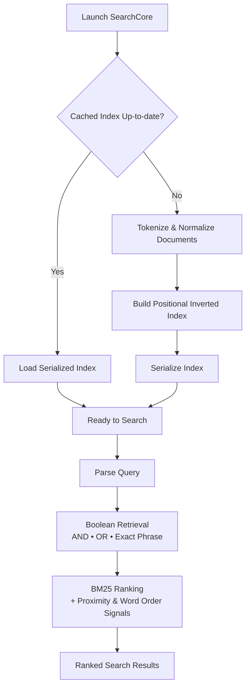

# SearchCore

> **From 1.16 million indexed tokens to single-digit microsecond query latency—SearchCore is a search engine built from scratch in modern C++ for fast, predictable document retrieval.**

SearchCore indexes local documents using a positional inverted index and retrieves relevant results through **AND**, **OR**, and **Exact Phrase** retrieval, **BM25-based ranking extended with proximity and word-order awareness**, and **persistent binary serialization** to reduce startup time by reusing a previously built index. Every major subsystem evolved through repeated benchmarking, profiling, and optimization, with engineering decisions informed by measured performance.

During indexing, documents are tokenized, normalized, and stored in a positional inverted index containing document IDs, page numbers, and token positions. The index is serialized into a compact binary format and reloaded on subsequent launches, eliminating the need to rebuild the corpus. During retrieval, Boolean filtering, positional matching, and BM25-based scoring enhanced with proximity and word-order signals are combined before returning the highest-ranked results through a Top-K priority queue.

---

## Highlights

- **Positional Retrieval**  
  Stores document IDs, page numbers, and token positions to support **AND**, **OR**, **Exact Phrase**, and cross-page phrase matching.

- **Custom Ranking Pipeline**  
  Extends BM25 with proximity and word-order awareness to improve retrieval quality while returning the highest-ranked documents through a Top-K priority queue.

- **Persistent Binary Serialization**  
  Serializes the complete positional index into a compact binary format, reducing subsequent startup from rebuilding the corpus to loading a cached index.

- **Automatic Cache Invalidation**  
  Detects additions, removals, or modifications within the document corpus and rebuilds the serialized index only when required.

- **Page-aware Search Results**  
  Returns the highest-ranked matching page together with additional matching pages, helping users navigate large documents more efficiently.

- **Performance Engineering**  
  Developed through iterative benchmarking, profiling, refactoring, and optimization, with measurable improvements across throughput, latency, startup time, memory usage, and serialization performance.

---

## Search Examples

### Exact Phrase Retrieval

`strict: gian singh`

> *(Screenshot)*

---

### Boolean OR Retrieval

`or: gian singh`

> *(Screenshot)*

---

### Built-in Benchmarking

`!benchmark`

> *(Screenshot)*

---

## Architecture

SearchCore is organized into a small set of focused modules, each responsible for a distinct stage of the retrieval pipeline—from tokenization and indexing to persistence and query execution.



| Module | Responsibility |
|----------|----------------|
| `tokenizer` | Cleans and normalizes document tokens before indexing. |
| `index_store` | Builds the positional inverted index and maintains the in-memory index. |
| `persistence` | Handles binary serialization, deserialization, and automatic cache validation. |
| `query_engine` | Executes Boolean retrieval, ranking, benchmarking, and result generation. |
| `main` | Coordinates indexing, cache loading, and the interactive command-line interface. |

---

## Engineering Decisions

SearchCore was designed around a consistent engineering philosophy: optimize for **fast, reliable, and predictable document retrieval** while keeping the architecture compact, understandable, and measurable.

### Choosing Memory Over Scalability

SearchCore loads the complete positional index into memory during startup instead of performing on-demand disk lookups. This intentionally trades scalability for significantly lower query latency by eliminating disk I/O during search. For the intended workload of interactive document retrieval, predictable in-memory execution better matched the project's goals than designing a disk-backed retrieval engine.

### Fewer Disk Writes, Faster Startup

Instead of writing posting lists incrementally, SearchCore packs each term's complete posting history into a contiguous buffer before serialization. This reduces the number of operating-system write calls while producing a compact persistent index that can be reloaded on future launches instead of rebuilding the corpus.

### Optimizing for CPU Cache, Not Big-O

Several parts of the retrieval pipeline intentionally favor contiguous memory layouts over theoretically faster data structures. Temporary page-hit collections use compact vectors instead of hash maps because the expected working set is typically very small. Although this sacrifices theoretical complexity, improved cache locality reduced overhead in the hot execution path.

### Making Persistence Reliable

The serialized index is automatically invalidated whenever the document corpus changes. SearchCore verifies the cached index before startup and rebuilds it only when necessary, ensuring the retrieval engine remains synchronized with the underlying documents while preserving fast startup for unchanged corpora.

### Purpose-Driven Design

SearchCore was built around a single objective: **fast, reliable, and predictable document retrieval**. Rather than maximizing the number of supported features, every major addition was evaluated against its impact on retrieval quality, architectural simplicity, implementation complexity, and the project's intended workload.

Features that directly strengthened the retrieval pipeline—such as positional indexing, persistent binary serialization, page-aware results, and customized BM25-based ranking—were prioritized. Design choices were made to keep the system focused, deterministic, and responsive, allowing every major feature to justify its place in the architecture instead of simply increasing feature count.

---

## Performance

All benchmarks were collected on the same hardware using release (`-O2 -flto`) builds under WSL2. Unless otherwise stated, measurements correspond to the current implementation (v5).

### Current Performance

| Metric | Result |
|---------|-------:|
| Document Corpus | 32 Documents |
| Indexed Tokens | 1,159,765 |
| Indexed Pages | 3,870 |
| Unique Tokens | 52,862 |
| Serialized Index Size | 12.49 MiB |
| Cold Index Build | ~1.25 s |
| Warm Startup | ~170 ms |
| Average Query Latency | ~3.7 μs |
| Query Throughput | ~270K Queries/sec |
| Peak Memory Usage | ~68 MB |

### Benchmark Comparison

| Metric | Baseline (v2) | Current (v5) | Improvement |
|---------|--------------:|-------------:|------------:|
| Query Throughput | ~66K QPS | ~270K QPS | **≈4.1×** |
| Average Query Latency | ~15 μs | ~3.7 μs | **≈75% lower** |
| Warm Startup | ~900 ms | ~170 ms | **≈81% faster** |
| Peak Memory Usage | ~94 MB | ~68 MB | **≈28% lower** |
| Serialization Time | ~248 ms | ~122 ms | **≈51% faster** |

Baseline measurements correspond to the earliest benchmarked implementation (v2). Current measurements correspond to the latest optimized implementation (v5). All measurements were collected on the same hardware using the same document corpus.

### Benchmark Environment

| Component | Specification |
|-----------|---------------|
| CPU | Intel Core i5-13420H |
| RAM | 16 GB |
| Operating System | Windows 11 + WSL2 |
| Compiler | g++ (C++20) |
| Build Flags | `-O2 -flto` |

---

## Engineering Evolution

SearchCore was developed iteratively, with each stable milestone committed after significant architectural, performance, or maintainability improvements.

| Version | Engineering Milestone | Reference |
|---------|------------------------|-----------|
| **v0** | Initial positional inverted index and retrieval pipeline | `00838af` |
| **v1** | Boolean retrieval, Top-K ranking, benchmarking | `a4bb9b0` |
| **v2** | Persistent serialization and cache validation | `e5677e5` |
| **v3** | Reduced disk I/O and serialization optimizations | `b054319` |
| **v4** | Query pipeline optimization and benchmarking refinement | `201ccc7` |
| **v5** | Modular architecture and production-ready refactor | `6b71153` |

---

## Project Structure

```text
SearchCore/
├── corpus/               # Sample document corpus
├── tokenizer.*           # Tokenization & normalization
├── index_store.*         # Positional inverted index
├── persistence.*         # Serialization & cache management
├── query_engine.*        # Retrieval, ranking & benchmarking
├── main.cpp              # Application entry point
├── makefile
└── README.md
```

---

## Build

```bash
git clone <repository-url>

cd SearchCore

make run
```

---

## Usage

| Command | Description |
|----------|-------------|
| `power finance` | Default Boolean AND search |
| `or: power finance` | Boolean OR search |
| `strict: power finance` | Exact phrase search |
| `!benchmark` | Executes the built-in benchmark suite |

---

## Future Work

The current architecture provides a strong foundation for several future enhancements.

- Field-aware ranking
- Fuzzy search
- Stemming and lemmatization
- Incremental indexing
- Multi-threaded indexing
- Disk-backed indexing for larger corpora

---

## License

This project is released under the MIT License.
