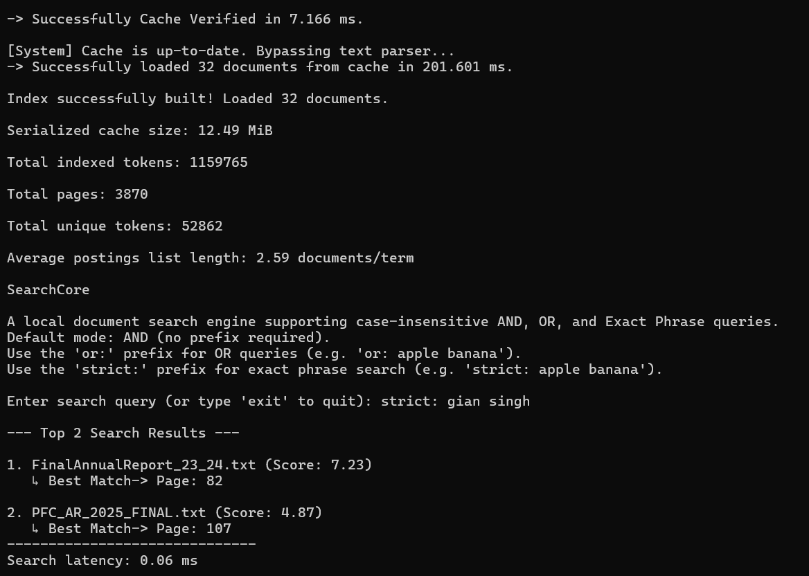
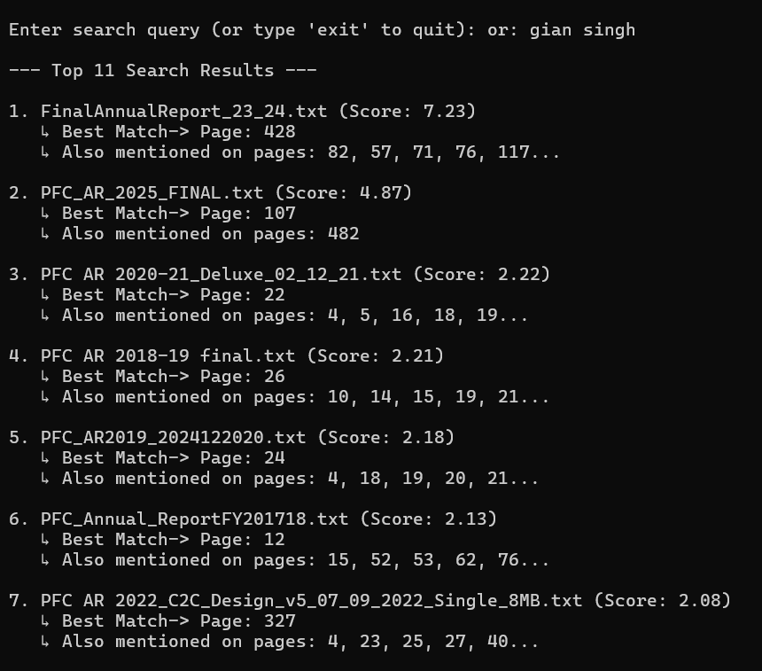
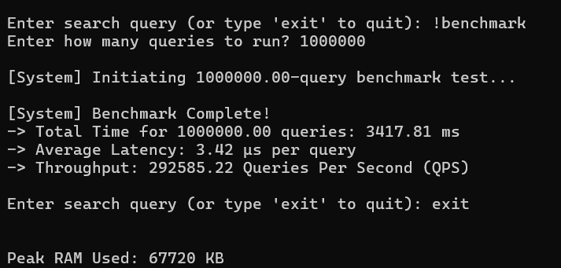
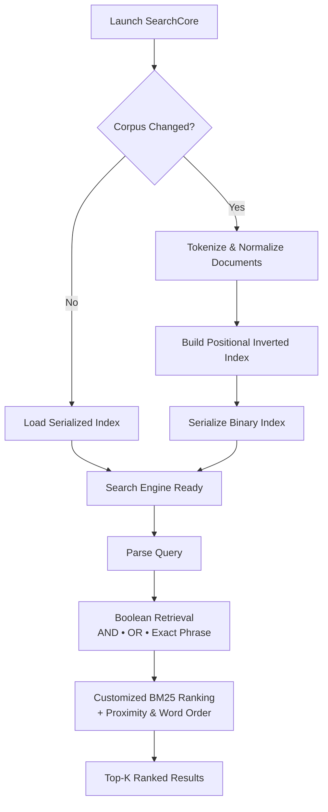

# SearchCore

> **From 1.16 million indexed tokens to single-digit microsecond query latency—SearchCore is a search engine built from scratch in modern C++ for fast, predictable document retrieval.**

SearchCore was built to explore the engineering behind modern document retrieval systems—not just inverted indexes, but the complete retrieval pipeline from indexing and persistence to ranking, optimization, and system design.

At a high level, SearchCore indexes local documents, supports **Boolean (AND/OR)** and **Exact Phrase** search, remembers previously built indices for rapid startup, and ranks results using a customized BM25 pipeline that rewards proximity and correct word order.

During indexing, documents are tokenized, normalized, and stored in a positional inverted index containing document IDs, page numbers, and token positions. The index is serialized into a compact binary format and reloaded on subsequent launches, eliminating unnecessary rebuilds. During retrieval, Boolean filtering, positional matching, and customized BM25 scoring are combined before returning the highest-ranked documents through a fixed-size Top-K priority queue.

---

# Highlights

- **Performance Engineering**  
  Developed through iterative benchmarking, profiling, refactoring, and optimization, producing measurable improvements across query throughput, latency, startup time, serialization speed, and memory usage.

- **Positional Inverted Index**  
  Stores document IDs, page numbers, and token positions to support **AND**, **OR**, **Exact Phrase**, and cross-page phrase retrieval.

- **Customized Ranking Pipeline**  
  Extends BM25 with proximity and word-order awareness to prioritize documents whose matching terms occur closer together and in the intended sequence.

- **Persistent Binary Serialization**  
  Serializes the complete positional index into a compact binary format, reducing subsequent startup from rebuilding the corpus to loading a cached index.

- **Automatic Cache Invalidation**  
  Detects additions, removals, or modifications within the document corpus and rebuilds the serialized index only when necessary.

- **Page-aware Search Results**  
  Returns the highest-ranked matching page together with additional matching pages, helping users navigate large documents efficiently.

---

# Example Queries

The examples below demonstrate exact phrase retrieval, Boolean retrieval, and the built-in benchmarking utility.

## Exact Phrase Search

```text
strict: gian singh
```

<!------>
<p align="center">
  
</p>

---

## Boolean OR Search

```text
or: gian singh
```

<!------>
<p align="center">
  
</p>
<p align="center">
  <em>Output cropped to highlight the highest-ranked search results.</em>
</p>

---

## Built-in Benchmark

```text
!benchmark
```

<!------>
<p align="center">
  
</p>

---

# Architecture

SearchCore is organized into a small set of focused modules, each responsible for a distinct stage of the retrieval pipeline—from document processing and persistence to query execution and ranking.



| Module | Responsibility |
|:--------|:---------------|
| `main` | Coordinates startup, cache validation, indexing, and the interactive command-line interface. |
| `tokenizer` | Cleans, normalizes, and standardizes document tokens before indexing. |
| `index_store` | Builds and stores the in-memory positional inverted index. |
| `persistence` | Handles binary serialization, deserialization, and automatic cache validation. |
| `query_engine` | Executes Boolean retrieval, exact phrase matching, ranking, benchmarking, and result generation. |

---

# Design Decisions

SearchCore was designed around a single engineering objective: build a retrieval engine that is **fast, reliable, deterministic, and easy to reason about**, while keeping the architecture compact enough to evolve through iterative optimization.

Every major feature was evaluated against that objective before being implemented.

## Purpose-Driven Design

Rather than maximizing the number of supported features, every addition was evaluated against its impact on retrieval quality, architectural simplicity, implementation complexity, and the intended workload.

Features that directly strengthened the retrieval pipeline—such as positional indexing, persistent serialization, page-aware results, and customized BM25 ranking—were prioritized. Features that conflicted with the project's goals or introduced disproportionate complexity were intentionally left outside the project's scope.

---

## Choosing Memory Over Scalability

SearchCore loads the complete positional index into memory during startup instead of performing on-demand disk lookups.

This intentionally trades scalability for significantly lower query latency by eliminating disk I/O during retrieval. For the intended workload of interactive document search, predictable in-memory execution better matched the project's objectives than designing a disk-backed retrieval engine.

---

## Reducing Disk I/O

Instead of writing posting lists incrementally, SearchCore packs each term's complete posting history into a contiguous buffer before serialization.

This greatly reduces operating-system write calls while producing a compact binary index that can be loaded directly on subsequent launches without rebuilding the corpus.

---

## Optimizing for CPU Cache, Not Big-O

Several parts of the retrieval pipeline intentionally favor contiguous memory layouts over theoretically faster data structures.

Temporary page-hit collections use compact vectors instead of hash maps because the expected working set is typically very small. Although this sacrifices theoretical asymptotic complexity, improved cache locality reduces overhead in the engine's hottest execution paths.

---

## Reliable Persistence

The serialized index is automatically invalidated whenever the document corpus changes.

SearchCore verifies the cached index during startup and rebuilds it only when necessary, ensuring cached data always remains synchronized with the underlying documents while preserving rapid startup for unchanged corpora.

---

# Performance

The current implementation has been evaluated on a corpus of long-form reports, notices, and policy documents containing over **1.16 million indexed tokens**, with every major subsystem refined through iterative benchmarking, profiling, refactoring, and performance optimization.

All benchmarks were collected on the same hardware using release (`-O2 -flto`) builds under WSL2. Unless otherwise stated, measurements correspond to the latest optimized implementation (v5).

## Current Benchmarks

| Metric | Result |
|:--------|-------:|
| **Indexed Tokens** | **1,159,765** |
| Documents Indexed | 32 |
| Indexed Pages | 3,870 |
| Unique Tokens | 52,862 |
| Serialized Index Size | 12.49 MiB |
| **Query Throughput** | **~270K Queries/sec** |
| **Average Query Latency** | **~3.7 μs** |
| **Warm Startup** | **~170 ms** |
| Peak RAM Usage | ~68 MB |
| Cold Index Build | ~1.25 s |

---

## Optimization Impact

SearchCore evolved through several optimization iterations, with each stable milestone benchmarked before the next stage of development.

| Metric | Baseline (v2) | Current (v5) | Change |
|:--------|--------------:|-------------:|-------:|
| Query Throughput | ~66K QPS | ~270K QPS | **≈4.1×** |
| Average Query Latency | ~15 μs | ~3.7 μs | **↓75%** |
| Warm Startup | ~900 ms | ~170 ms | **↓81%** |
| Peak RAM Usage | ~94 MB | ~68 MB | **↓28%** |
| Serialization Time | ~248 ms | ~122 ms | **↓51%** |

Baseline measurements correspond to the earliest benchmarked implementation (v2), while current measurements correspond to the latest optimized implementation (v5). Both were collected on the same hardware using the same document corpus.

---

## Benchmark Environment

| Component | Specification |
|:----------|:--------------|
| Processor | Intel Core i5-13420H |
| Memory | 16 GB RAM |
| Operating System | Windows 11 + WSL2 |
| Compiler | g++ (C++20) |
| Build Flags | `-O2 -flto` |

---

# Engineering Evolution

Each stable milestone represents a committed implementation after significant architectural, performance, or maintainability improvements.

| Stage | Focus | Milestone | Reference |
|:------|:------|:----------|:----------|
| Initial | Foundation | Initial positional inverted index and retrieval pipeline | `00838af` |
| v1 | Retrieval | Boolean retrieval, Top-K ranking, and benchmarking | `a4bb9b0` |
| v2 | Persistence | Binary serialization and cache validation | `e5677e5` |
| v3 | Disk I/O | Serialization and disk-write optimization | `b054319` |
| v4 | Optimization | Retrieval pipeline optimization and benchmarking refinement | `201ccc7` |
| v5 | Architecture | Modular refactoring and production-ready project structure | `6b71153` |

---

# Project Structure

```text
SearchCore/
├── assets/
│   ├── exact_phrase_search.png
│   ├── boolean_or_search.png
│   └── benchmark.png
├── corpus/               # Sample document corpus
├── core_index.dat        # Generated serialized index (created after first build)
├── tokenizer.*           # Tokenization & normalization
├── index_store.*         # Positional inverted index
├── persistence.*         # Binary serialization & cache validation
├── query_engine.*        # Retrieval, ranking & benchmarking
├── main.cpp              # Application entry point
├── makefile
├── LICENSE.md
└── README.md
```

---

# Getting Started

```bash
git clone https://github.com/SagarGuptaX/SearchCore.git

cd SearchCore

make run
```

SearchCore automatically builds a serialized index during the first run. Subsequent launches reuse the cached index and rebuild it only when changes are detected within the document corpus.

---

# Usage

| Command | Description |
|:---------|:------------|
| `power finance` | Default Boolean **AND** search |
| `or: power finance` | Boolean **OR** search |
| `strict: power finance` | Exact Phrase search |
| `!benchmark` | Executes the built-in benchmarking utility |

---

# Future Work

Potential directions for future development include:

### Retrieval

- Fuzzy search
- Stemming and lemmatization

### Ranking

- Field-aware ranking

### Performance

- Multi-threaded indexing

### Scalability

- Incremental indexing
- Disk-backed indexing for larger corpora

---

# License

This project is licensed under the MIT License.
